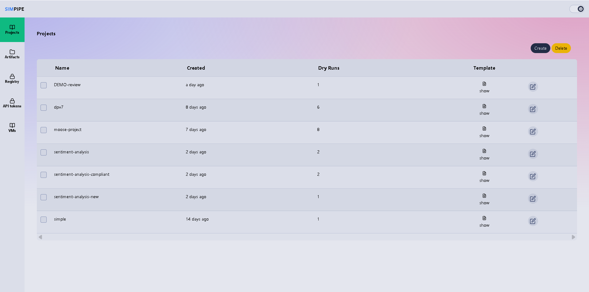

  <h1>SIM-PIPE</h1>
  

## **General Description**
SIM-PIPE generates and simulates a deployment configuration for the final deployment that conforms to the hardware requirements and includes any additional necessary middleware inter-step communication code. Finally, the tool provides a pipeline testing functionality, including a sandbox for evaluating individual pipeline step performance, and a simulator to determine the performance of the overall Big Data pipeline. Specifically, SIM-PIPE provides the following high-level features:

- Deploying each step of a pipeline and running it in a sandbox by providing sample input
- Evaluating pipeline step performance by recording and analysing metrics about its execution in order to identify bottlenecks and steps to be optimized
- Identification of resource requirements for pipeline by calculating step performance per resource used

## **Related Compliance aspects**
- Provides privacy analysis of output artifacts produced by data pipelines

## **Main Goal/Functionalities**
SIM-PIPE provides a user-friendly interface for profiling, testing, and analyzing data pipelines, supporting resource analysis and performance evaluation.

## **Architecture**

SIM-PIPE consists of a stateless NodeJS controller, a SvelteKit graphical user interface, and several open-source components. The controller provides a GraphQL API for the graphical user interface and other tools of the DataCloud toolbox. The system is designed to mirror real-world systems for accurate simulation, and to operate seamlessly on a developer’s laptop using only open-source software components.

## Kubernetes, the container orchestration platform

## **Component Definition**

The SIM-PIPE platform is composed of the following main components:

- **Kubernetes, the container orchestration platform**: Kubernetes (K8s) automates deploying, scaling, and managing containerised applications. It provides a resilient framework for distributed systems, supporting features like failover, scaling, and rolling updates. SIM-PIPE leverages Kubernetes for managing complex infrastructures and running data pipelines in environments that closely resemble production.

- **Argo Workflows, to run software container-based data pipelines**: Argo Workflows is a container-native workflow engine for orchestrating data pipelines and jobs on Kubernetes. It supports complex job orchestration using Directed Acyclic Graphs (DAG), parameterisation, artefact handling, and retries on failures.

- **cAdvisor, to gather detailed metrics**: cAdvisor monitors running container resource usage and performance characteristics, providing metrics such as CPU, memory, network, and filesystem usage. It supports real-time and historical data collection, and can expose data to storage backends like Prometheus.

- **Prometheus, to collect and store metrics**: Prometheus is a monitoring and alerting toolkit that scrapes metrics from instrumented jobs and stores samples locally. It supports a flexible query language (PromQL) and remote storage integrations for scalable data storage.

- **MinIO, the object store**: MinIO is an open-source object storage server compatible with Amazon S3, used to securely store files, including inputs, outputs, and intermediate data for pipelines. It can be replaced with any S3-compatible storage system.

- **SFTPGo, every file transfer protocol for everyone**: SFTPGo extends the S3-based storage infrastructure, supporting multiple file transfer protocols (SFTP, HTTP, FTP(S), WebDAV) for flexible file manipulation.

- **Grafana, to make beautiful dashboards**: Grafana provides analytics and interactive visualisation, allowing users to display and analyse metric data in various formats, including time-series plots and heatmaps.

- **PostgreSQL, to persist long-term data**: PostgreSQL is used to archive completed runs from Argo Workflows, segregating active and archived data for efficient operation.

- **K3S, a good Kubernetes Distribution**: K3S is a lightweight Kubernetes distribution recommended for users without a preferred distribution. It is suitable for resource-constrained environments and local development.

- **Docker, the classic software container command line interface**: Docker CLI is used for building and managing containers, with compatibility for alternatives like Nerdctl and Podman.

- **KWOK, Kubernetes Pretend Play**: KWOK simulates large Kubernetes clusters for testing and experimentation without running real containers.

- **gVisor, a sandbox for software containers**: gVisor provides an additional isolation layer for running containers, enhancing security by intercepting system calls and acting as a guest kernel.

This modular architecture allows SIM-PIPE to provide a robust, flexible, and production-like environment for data pipeline simulation and analysis.

## **Screenshots**

## **Commercial Information**

| Organisation (s) | License Nature | License |
|------------------|----------------|---------|
| DataCloud Project | Open Source | Apache 2.0 |

## **Expected KPIs**

|What (types)|How(Process)|Values|
|-----|--------------------|--------------|
| Pipeline profiling effectiveness | User can test and profile pipelines, identify bottlenecks, and optimize resources | At least 50% reduction in resource consumption and error-free deployment |

## **Related Project Links**

| Project Links |
| ------------- |
| [SIM-PIPE GitHub Repository](https://github.com/DataCloud-project/SIM-PIPE) |

## **How To Install**

SIM-PIPE can be installed in several ways, depending on your environment and requirements:

- **Automated installation**: You can use Python-based installation scripts (not included in this repository) that will set up all dependencies and services for you, including Kubernetes, K3S, and required middleware. This is the recommended approach for users who want a quick and easy setup.

- **Helm chart installation**: If you already have a running Kubernetes or K3S cluster, you can deploy SIM-PIPE using the official Helm chart. This allows you to integrate SIM-PIPE into your existing infrastructure with minimal effort.

> **Note:** This repository is for documentation and description of the SIM-PIPE tool only. Installation scripts and deployment files are maintained in the main SIM-PIPE software repository or its distribution packages. Please refer to the [SIM-PIPE GitHub Repository](https://github.com/DataCloud-project/SIM-PIPE) for installation resources and instructions.

## **How To Use**

To use SIM-PIPE, run the provided Python script or launch the service as described in the installation instructions. This will start the SIM-PIPE frontend, which is user-friendly for creating, testing, and profiling data pipelines.

## **Other Information**

n/a

## **OpenAPI Specification**

n/a

## **Additional Links**

n/a